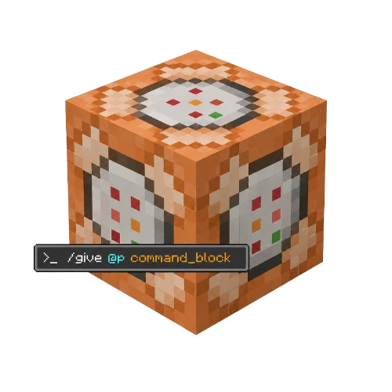

<div align="center">
  

  # Quick Command Blocks

  **Paste one line of `qcb` script to auto-create chained command blocks.**
</div>

<p align="center">
  <a href="https://github.com/1efan/qcBlocks/releases"></a>
  <a href="https://github.com/1efan/qcBlocks/blob/main/LICENSE"></a>
  <a href="https://github.com/1efan/qcBlocks/issues"></a>
  <br>
  
  
  
</p>

---

## What it does

Quick Command Blocks adds a single command - `/qcb` - that turns one line of script into a ready-made chain of pre-filled command blocks. No manually placing blocks, setting repeat/chain modes, or typing into each one.

```
/qcb dir=forward down=2; r: <command>; c: <command>; c: <command>
```

| Token | Meaning |
|-------|---------|
| `dir=` | Direction the chain runs (e.g. `forward`) |
| `down=` | How many blocks below the player to start |
| `r:`   | A **repeating** command block |
| `c:`   | A **chain** command block |

Each `r:` / `c:` segment becomes the next block in the chain, in order.

## Documentation

- [Scripting reference](docs/SCRIPTING.md) covers the full script format: headers,
  directions, block kinds, flags, shorthand, and worked examples.
- [Using an AI to write scripts](docs/AI_PROMPT.md) is a prompt you can paste into
  ChatGPT or Claude so it writes `/qcb` scripts from a plain-language request.

## Requirements

| | |
|---|---|
| Minecraft  | 26.1.2 |
| Mod loader | Fabric (loader `0.18.4+`) |
| Fabric API | `0.149.1+26.1.2` |
| Java       | 25+ |

## Install

1. Install [Fabric Loader](https://fabricmc.net/use/) and [Fabric API](https://modrinth.com/mod/fabric-api).
2. Drop the `qcblock-x.x.x.jar` into your `.minecraft/mods` folder.

## Build from source

```bash
git clone https://github.com/1efan/qcBlocks
cd qcBlocks
./gradlew build      # → build/libs/qcblock-0.1.0.jar
```

Requires JDK 25. (If `dependencies/` is empty, Fabric API is pulled from Maven automatically.)

## License

[MIT](LICENSE) © 1efan
